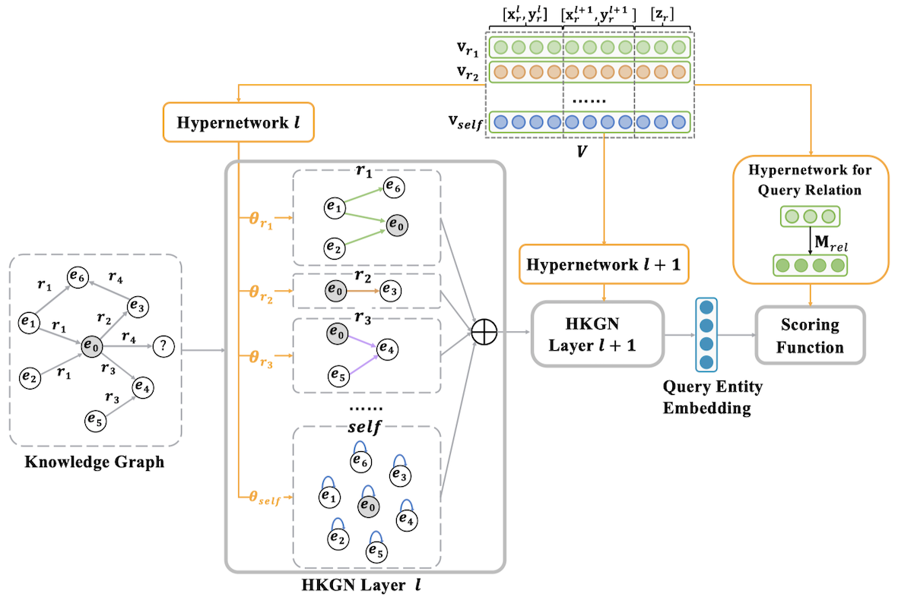

# Heterogeneous Graph Neural Network with Hypernetworks for Knowledge Graph Embedding 

## Overview


## Training the model

```bash
# default test dataset: FB15k-237
# FB25k-237 layer 2
python run.py -name test_fb15k_layer2 -gcn_dim 200 -gcn_drop 0.4 -model gen_rgcn -score_func conve -batch 1024 -epoch 1200 -gpu 0 -log_mode wandb -strategy one_to_n -test_batch 2048 -exp gen_ctx_conv_global_wo_r \
-gcn_layer 2 -layer2_drop 0.2 -layer1_drop 0.3
# FB15k-237 layer 1
python run.py -name test_fb15k_layer1 -gcn_drop 0.4 -model rgcn -score_func gen_conve -opn mult \
-batch 1024 -epoch 1200 -gpu 0 -strategy one_to_n -log_mode log -test_batch 2048 -exp gen_ctx_conv_global_wo_r
# WN18RR layer 1
python run.py -name test_wn18rr_layer1 -gcn_drop 0.4 -model gen_rgcn -score_func gen_conve -opn mult \
-batch 256 -epoch 1200 -gpu 0 -log_mode wandb -strategy one_to_n -
# ulimit -SHn 65536
```

